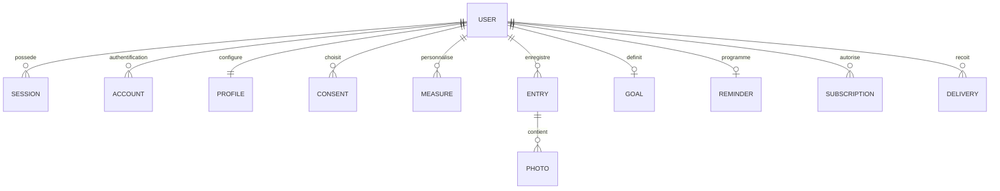

# Architecture

## Choix et organisation

La production utilise GitHub Pages et Supabase ; voir [l’état technique](etat-projet.md) et [le déploiement](deploiement.md). Les sections SQLite / Better Auth décrivent la version locale maintenue pour les essais et un hébergement autonome.

React et TypeScript portent l’interface ; Vite compile ses ressources. Fastify sert l’API et le bundle en production sur une seule origine. Better Auth assure mots de passe, cookies HttpOnly, inscription avec session immédiate, récupération et sessions, selon sa [documentation Fastify](https://better-auth.com/docs/integrations/fastify). Son cache de session est désactivé pour une révocation immédiate.

SQLite en WAL apporte une sauvegarde transactionnelle réelle sans service externe. Cette version convient à une instance avec volume persistant. Ne pas partager le fichier entre plusieurs machines. Pour augmenter la capacité : repositories PostgreSQL avec RLS, stockage objet privé et worker permanent séparé. Les types et calculs partagés restent réutilisables.

| Chemin                 | Rôle                                                         |
| ---------------------- | ------------------------------------------------------------ |
| `src/screens/`         | Parcours mobiles en français                                 |
| `src/components.tsx`   | Composants de design et graphiques                           |
| `src/styles.css`       | Palette et règles communes                                   |
| `shared/`              | Nom, types, catalogue, consentements, calculs et récurrences |
| `server/auth.ts`       | Comptes et email transactionnel                              |
| `server/app.ts`        | API, validation, autorisations et uploads atomiques          |
| `server/repository.ts` | Accès aux sources et images privées                          |
| `server/jobs.ts`       | Planification, déduplication et purge                        |
| `server/retention.ts`  | Effacement et protection contre les restaurations            |
| `server/migrations/`   | Migrations SQL versionnées                                   |
| `public/`              | Police locale, manifest, icônes et service worker            |
| `tests/`               | Calculs, isolation et parcours navigateur                    |

## Modèle

- Tables Better Auth : `user`, `account`, `session`, `verification`, `rateLimit`.
- `profiles` : taille facultative, démarrage terminé, fuseau, ordre des favoris et dernière activité.
- `consents` : événements avec finalité, texte, version, statut et date UTC. Le dernier événement fait autorité.
- `measures` : personnalisations, unité et archive. Les quinze mesures standard, poids inclus, viennent du catalogue partagé.
- `entries` : jour local ISO, stature historique, valeurs présentes en JSON, note, dates techniques et clé d’idempotence.
- `photos` et la colonne `profiles.avatar` : stockage historique conservé pour compatibilité, sans nouvel envoi ni affichage.
- `goals` : départ, cible, mesure et date ; un objectif actif par compte.
- `reminders` : règle locale, ancre, canal, occurrence UTC et révision.
- `subscriptions` : compte et appareil.
- `deliveries` : unicité compte / occurrence / révision / appareil, état d’envoi.
- `dev_mail` : messagerie locale temporaire, absente de l’API de production.

Les notes sont incluses dans l’entrée. Les bilans, ratios, séries et comparaisons sont recalculés à partir des sources, sans copie persistante à invalider.

Les migrations Better Auth précèdent les fichiers SQL, appliqués dans l’ordre et suivis par `schema_migrations`. Sauvegarder avant une mise à jour et tester sa restauration.

## Règles d’accès

Chaque route privée obtient l’utilisateur de sa session vérifiée. Aucun identifiant de propriétaire fourni par le navigateur n’est utilisé. Toutes les lectures et mutations utilisent ce propriétaire, y compris mesures, objectifs, abonnements, exports et rappels. Les clés étrangères ont `ON DELETE CASCADE`.

SQLite n’a pas de RLS : l’API est son unique point d’accès. Les tests avec deux comptes couvrent les identifiants modifiés. Les requêtes SQL sont paramétrées. Les notes sont rendues comme texte par React.

Les mutations contrôlent l’origine et un en-tête spécifique ; Better Auth protège ses propres endpoints. Il n’y a pas de CORS permissif. Helmet configure CSP et protections HTTP. La limitation globale est complétée par celles des uploads et exports. Les réponses privées portent `no-store, private`.

Les logs HTTP détaillés sont désactivés : aucune mesure, note, image, adresse push ou jeton n’est journalisé. Les fichiers privés restent hors de la racine publique. HTTPS et volumes / sauvegardes chiffrés doivent être configurés par l’exploitant ; SQLite ne fournit pas de chiffrement applicatif dans cette version.

## Anciennes photos

La fonctionnalité photo a été retirée le 6 octobre 2026. Les formulaires, la galerie, la comparaison et l’avatar sont supprimés, ainsi que le traitement et l’envoi d’images dans les API locale et cloud. Les entrées sont enregistrées en JSON ; une mesure ou une note est nécessaire. Les exports ZIP contiennent uniquement les données JSON et CSV.

Les anciennes tables, fichiers privés et métadonnées sont conservés pour compatibilité. Le retrait du suivi, la suppression d’une entrée et la suppression du compte continuent de nettoyer ces fichiers. La révocation d’un ancien consentement photo reste possible côté API ; son activation est refusée.

## PWA et tâches

Le service worker conserve seulement le shell et les ressources publiques. API, photos privées, sessions et exports sont exclus du cache. Hors connexion, le shell peut s’ouvrir ; une sauvegarde exige toujours le serveur.

Le planificateur tourne toutes les 30 secondes. Chaque livraison est revendiquée en base avant l’envoi ; la contrainte unique évite un doublon même si une tâche est répétée. L’autorisation est recontrôlée avant chaque appareil. Les abonnements 404 / 410 sont supprimés.

Cette convention est « au plus une tentative » : une erreur après revendication n’est pas automatiquement rejouée, afin de ne pas dupliquer une livraison dont la réception est incertaine. Surveiller les échecs. Les occurrences de plus d’une heure sont sautées. Un message déjà confié au fournisseur ne peut pas être rappelé ; tous les futurs traitements sont bloqués au retrait.
